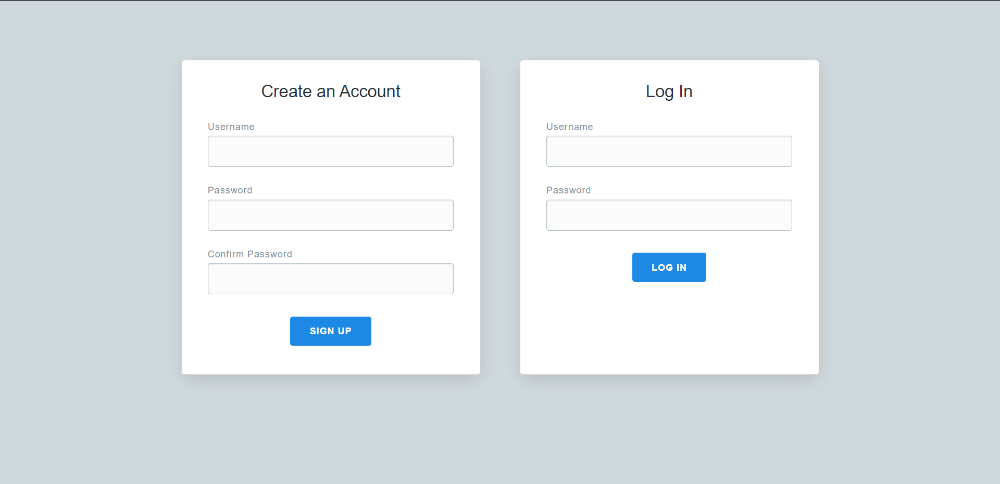
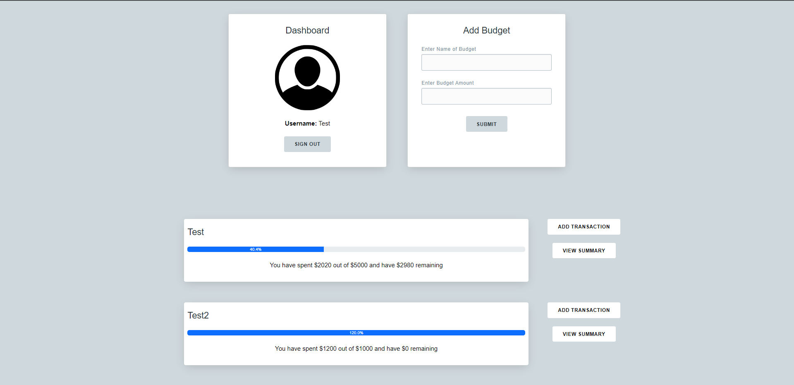

# Budget-Tracker
A web app that allows users to sign up/log in and keep track of budgets and transactions.

### Log In/Sign Up Page

### Dashboard

## Tech Stack
The web app utilizes HTML/CSS along with JavaScript to create the UI. The backend is powered by Python (specifically the Flask Libray). User data is stored using NOSQL in a MongoDB database. Quearies are made using HTTP Requests.